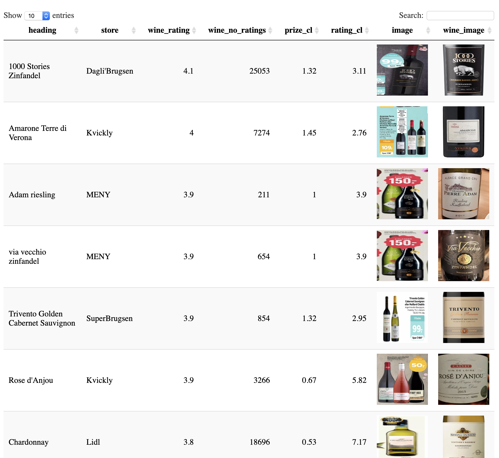

```{r setup, include=FALSE}
knitr::opts_chunk$set(echo = TRUE)
```

So, yesterday evening I finished a course on Wine on Udemy called "[Mastering wine - Jancis Robinson's Shortcuts to Success](https://www.udemy.com/share/1004c6BkUfc1xR/)". I am not an avid wine drinker, but I want to be posh with all the rest of the wine-drinkers in Copenhagen AND simultaniously seem like I know what I am doing.

One of my main take aways from the course was to test and experiment with wine. To buy different bottles of wine, try them out, see what you like, and repeat. The teacher in the course suggested you befriend your local wine-dealer and get recommendations from them on where to start.

But as a true data enthusiast I thought: there must be a data driven solution to exploring the world of wine. And preferably in a way where you get good wine at a good price. 

### Solution: R + etilbudsavis + vivino

So I decided to use R to try to combine the wines on offer (discounted) at my local supermarkets with their ratings on [Vivino](https://www.vivino.com/) (the leading wine-rating app in the world). I am a strong believer in "wisdom of crowds", so if enough of the vivino-crowd have judged a wine to be good, then they are probably right. 

To get the local wines on offer I took a look at the site [etilbudsavis](https://etilbudsavis.dk/) that aggregates offers from the surrounding supermarkets. It was very easy to mimic the API call that the site does to get data when you search for wine (for instance) - and voila, a list of all wines on offer within a 4 kilometre radius.

Now that I had the a list of the local wines on offer, I now needed to get their ratings from Vivino so I could decide if any of them would be a good buy. 

Here I wrote a crawler that visited the Vivino site and gave the wine name as a search string. Then I scraped the first wine that the search returned. 

I wasn't overly concerned with getting all wines correct, but more on creating a data set to start from. In order to see if the wines from the local store and vivino are the same I also retrieved their respective pictures of the wines in order to do a visual inspection later.

Then I used the `DT` package in R to create a little website where I could browse the different wines. (See the picture below)

Finally I went and bought the "1000 Stories Zinfandel"" at my local Dagli'Brugsen - I mean a 4.1 rating across 25,000 raters; I have to try that! And it's half price!


